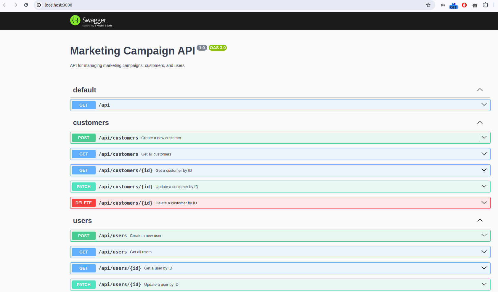
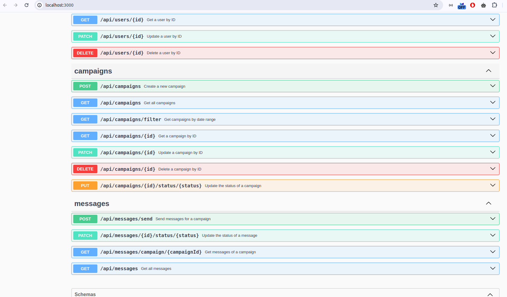
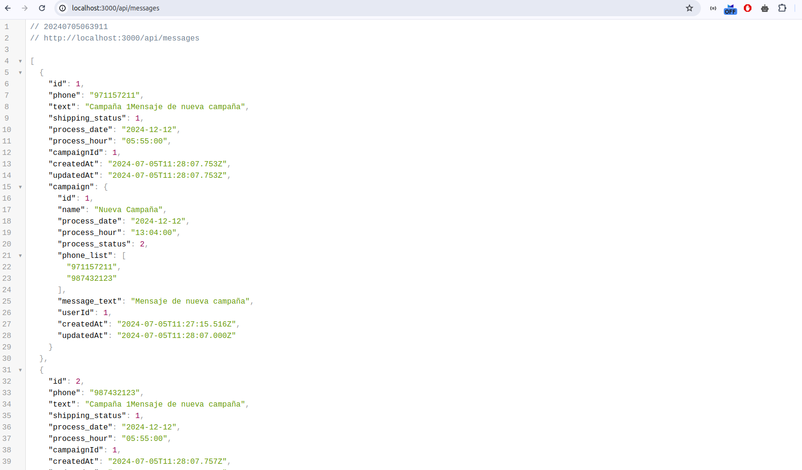

<p align="center">
  <a href="http://nestjs.com/" target="blank"></a>
</p>

[circleci-image]: https://img.shields.io/circleci/build/github/nestjs/nest/master?token=abc123def456

## Sinapsis Backend 
## Description
  - Serverless Framework
  - Node v18.17 +
## Installation

```bash
$ npm install
```
## Configura las variables .env para la conexion MySQL
```
DB_HOST=localhost
DB_PORT=3306
MYSQL_DB=sinapsis
MYSQL_USER=root
MYSQL_PASSWORD=root
```
## Serverless Offline
```bash
# Primero build del proyecto
$ npm run build
# Comando para levantar el api con el framework serverles offline, 
$ sls offline
```
## Open Api Swagger 
http://localhost:3000/



## Api URL
http://localhost:3000/api/

## Running the app

```bash
# development
$ npm run start

# watch mode
$ npm run start:dev

# production mode
$ npm run start:prod
```
